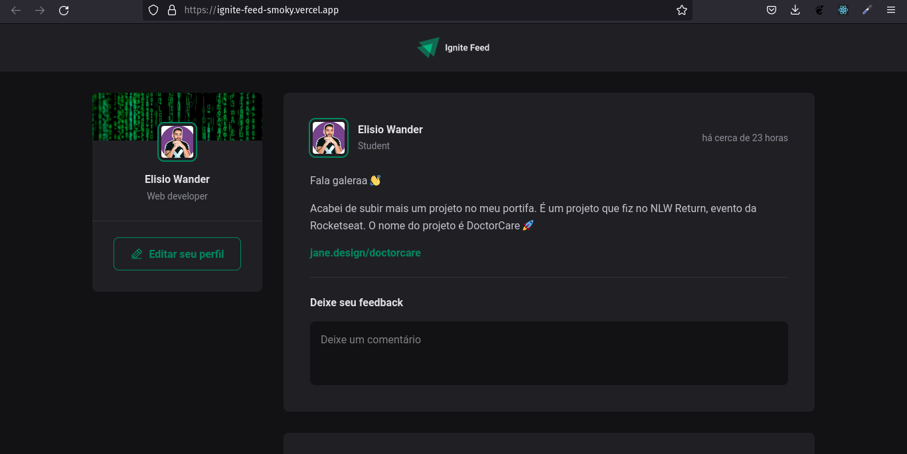

<h1 align="center">
    Ignite.Feed
</h1>

<h1 align="center">
     
</h1>

## 🏷️ Sobre 
**Ignite.Feed**: Plataforma onde você pode criar, deletar e dar like em um comentário. 

## OBS
Objetivo foi relembrar alguns conceitos importantes do React.js e Typescript

---

## 🛠️ Tecnologias e serviços utilizados
Foram utilizadas as seguintes tecnologias para desenvolver a aplicação **Ignite.Feed** :

- [HTML5](https://html.com/)
- [React.js](https://pt-br.reactjs.org/)
- [Typescript](https://www.typescriptlang.org/)
- [SASS](https://sass-lang.com/)

---

## 🗂️ Como baixar e iniciar o projeto 

```bash

    #clonar o projeto
    $ git clone https://github.com/ElisioWander/ignite-feed.git

    #entrar no diretório
    $ cd ignite-feed

    #instalar as dependências
    $ npm install

    #iniciar a aplicação
    $ npm run dev
```
### Servidor local
localhost:3000

---

## Autor
### 👤 Elisio Wander

- Linkedin: [@elisioWander](https://www.linkedin.com/in/elisio-wander-b88b69136/)
- Github: [@elisioWander](https://github.com/ElisioWander)
- Site: [elisiowander.vercel.app](https://elisiowander.vercel.app)
- Deploy [ignite-feed](https://ignite-feed-smoky.vercel.app/)

---
## 📝 Licença
Copyright © 2020 [@ElisioWander](https://github.com/ElisioWander/ignite-feed/blob/main/LICENSE)

Este projeto está sobe a [LICENÇA MIT](https://opensource.org/licenses/MIT)

---

### Desenvolvido 💜 by Elisio Wander
